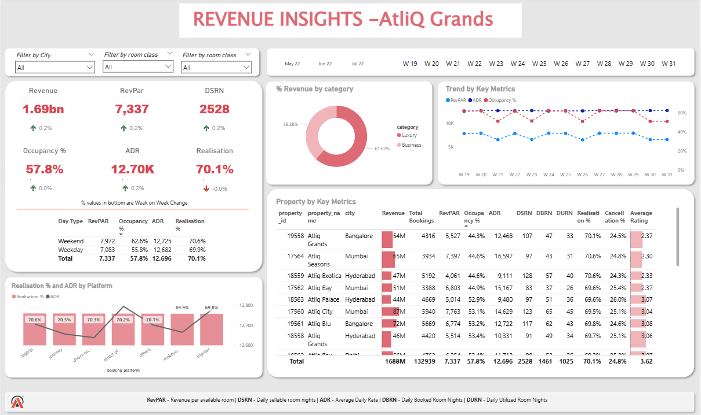

# AtliQ Grands - Revenue Insights Dashboard

## Overview
This project provides comprehensive revenue insights for AtliQ Grands, a luxury hotel chain operating across India. Using Power BI, the dashboard analyzes key hospitality metrics to help the management team make data-driven decisions to regain market share and improve revenue performance in the luxury hotel segment.

## Problem Statement
AtliQ Grands has been losing market share and revenue to competitors in the luxury/business hotels category despite 20 years in the hospitality industry. This project aims to incorporate Business Intelligence to provide actionable insights from historical data to help the company regain its competitive position.

## Dashboard Preview

## Features
- **Interactive Dashboard**: Filter by city, room class, and time periods
- **Key Performance Indicators**: 
  - Revenue (1.69bn)
  - RevPAR (7,337)
  - Occupancy % (57.8%)
  - ADR (12.70K)
  - Realization % (70.1%)
  - DBRN (2528)
- **Multi-dimensional Analysis**:
  - Revenue by category
  - Trend analysis by key metrics
  - Property-wise performance metrics
  - Day type analysis (Weekend vs Weekday)
  - Realization % and ADR by platform

## Data Sources
The dashboard utilizes historical booking and revenue data from AtliQ Grands properties across major Indian cities including:
- Bangalore
- Mumbai
- Hyderabad
- Delhi

## Technologies Used
- **Power BI**: For data visualization and dashboard creation
- **SQL**: For data extraction and transformation
- **Excel**: For data preparation and initial analysis

## Dashboard Components
1. **Revenue Overview**: Top-level KPIs with week-over-week changes
2. **Revenue by Category**: Breakdown of revenue streams by category (Luxury, Business)
3. **Trend Analysis**: Week-by-week performance of key metrics
4. **Property Performance**: Detailed metrics by individual hotel properties
5. **Booking Analysis**: Analysis of bookings by day type and platform

## Key Metrics Explained
- **RevPAR**: Revenue per available room
- **ADR**: Average Daily Rate
- **DBRN**: Daily Booked Room Nights
- **DURN**: Daily Utilized Room Nights
- **SRN**: Daily sellable room nights
- **Realization %**: Ratio of utilized to booked room nights
- **Cancellation %**: Percentage of bookings that were cancelled

## How to Use
1. **Clone the repository** to your local machine
2. **Open the .pbix file** using Power BI Desktop
3. **Refresh the data** if needed
4. **Interact with filters** to analyze specific segments or time periods

